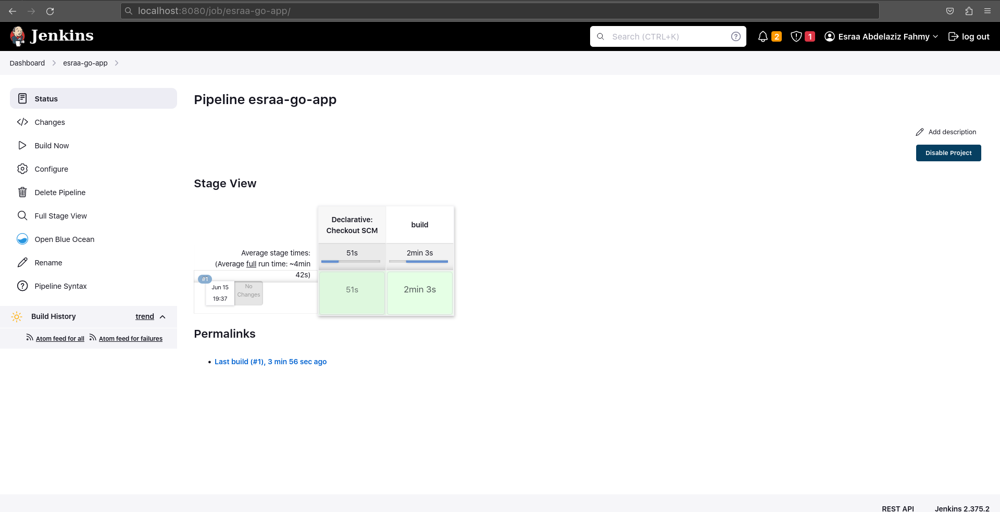

# This program is very simple, it connects to a MySQL database based on the following env vars:

 * MYSQL_HOST
 * MYSQL_USER
 * MYSQL_PASS
 * MYSQL_PORT
 
Requirements :

 - Dockerfile that build the application.
 - Pipeline job (jenkinsfile) to build the application using dockerfile and reports if any errors happened in the build.
 - The output of the build step should be a docker image pushed to dockerhub. 
 - Docker compose file that contains both application and mysql database to the application locally.
 - Helm manifests for kubernetes to deploy the application using them on kubernetes with adding config to support high availability and volume persistence and exposing service to the public.
 
 
1- Create Dockerfile to dockerize the app. 
2- Build the app.
          
     docker build . -t esraazizo/esraa-go-app
      
   
   
3- Create docker compose file that contain 2 services for mysql and the application.
 
   
   
   

4- Check the application locally.
 
   - on port 9090 return null.
   
   
   
   - On /healthcheck it returns an OK message.
   
   
  
   - On GET it return null.
  
   
  
   - On POST it creates a new row.
  
   
 
   - On GET it return 1 row and so on.
  
   
   
   - Check On port 9090 it create 2 rows.
   
   
   
5- Installing jenkins using Docker on port 8080.

   
   
   - Login Jenkins and get password of admin.
   
   
   
   
   
   - Getting started Jenkins.
  
   
   
   - Create new Credential of Docker-Hub.
   
   
   
   

   - Create new Pipeline.

   
   
   

6- Build Pipeline.
  
   
   
7- Docker Image was pushed to dockerhub successfully.

   
 
8- After installing helm tool on minikube or working with cluster do the next command 

    helm install go-app ./esraa-go-app 

9- Finally run the application locally.

   

 

